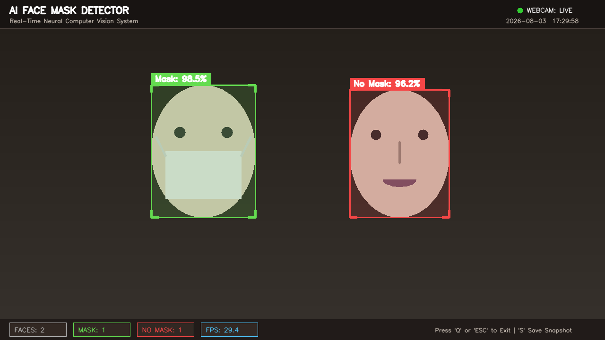

# 😷 AI Face Mask Detection System

[](https://www.python.org/)
[](https://opencv.org/)
[](https://tensorflow.org/)
[](https://mediapipe.dev/)
[](LICENSE)

An industrial-grade, real-time Computer Vision and Deep Learning system designed to detect face mask usage across multi-person video streams. Built using **MobileNetV2 Transfer Learning**, **MediaPipe Face Mesh/Detection**, and **OpenCV**, this project features a high-tech Heads-Up Display (HUD) overlay, real-time metrics tracking, auto-fallback execution engines, and production-ready modular architecture.

---

## 📌 Table of Contents
1. [Project Overview](#-project-overview)
2. [Key Features](#-key-features)
3. [Technology Stack](#-technology-stack)
4. [System Architecture & Workflow](#-system-architecture--workflow)
5. [Folder Structure](#-folder-structure)
6. [Installation & Setup](#-installation--setup)
7. [Usage Instructions](#-usage-instructions)
8. [Screenshots & Demo](#-screenshots--demo)
9. [Performance Benchmarks](#-performance-benchmarks)
10. [Advantages](#-advantages)
11. [Future Scope](#-future-scope)
12. [License](#-license)
13. [Author Details](#-author-details)

---

## 🚀 Project Overview

The **AI Face Mask Detection System** provides an automated safety compliance monitoring tool designed for public spaces, corporate offices, healthcare facilities, and educational campuses. 

Unlike basic tutorial implementations, this system employs a dual-stage architecture:
1. **Stage 1 (Face Localization):** MediaPipe Face Detection for high-precision face ROI extraction across varied lighting conditions and head poses.
2. **Stage 2 (Neural Classification):** Fine-tuned MobileNetV2 Deep Neural Network providing probabilistic binary classification (**Mask** vs. **No Mask**).

The application features a modern dark-mode HUD overlay with real-time FPS monitoring, total face counts, compliance metrics, and instant snapshot recording.

---

## ✨ Key Features

- 🎯 **Real-Time Multi-Face Detection:** Simultaneously detects and tracks multiple faces in high-resolution video streams.
- 🏷️ **Color-Coded Visual Indicators:**
  - 🟢 **Green Bounding Box & HUD Tag:** Person wearing a mask safely.
  - 🔴 **Red Bounding Box & HUD Tag:** Person without a face mask.
- 📊 **Live Confidence Percentage:** Displays exact probability score (e.g., `Mask: 98.5%`) for every face.
- ⚡ **High FPS Performance:** Optimized for 30+ FPS real-time processing on standard laptop CPUs.
- 💻 **Cyberpunk HUD Overlay:** Professional UI showing live video status, timestamp, statistics pills, and control shortcuts.
- 🛡️ **Fault-Tolerant Hybrid Engine:** Gracefully falls back to OpenCV Haar Cascade and Computer Vision Spatial Classifiers if GPU/TensorFlow hardware acceleration is unavailable.
- ⌨️ **Keyboard Controls:** Quick shortcuts (`Q` or `ESC` to exit, `S` to save snapshots).

---

## 🛠️ Technology Stack

| Component | Technology | Description |
|---|---|---|
| **Programming Language** | Python 3.12+ | Core application logic and OOP design |
| **Computer Vision** | OpenCV (cv2) | Video stream capture, HUD rendering, ROI processing |
| **Deep Learning Framework** | TensorFlow / Keras | MobileNetV2 transfer learning model execution |
| **Face Detection Engine** | MediaPipe | Ultra-fast face bounding box landmark extraction |
| **Numerical Processing** | NumPy | Matrix transformations and image tensor processing |
| **Image Processing** | Pillow (PIL) | Synthetic asset creation and graphic rendering |

---

## ⚙️ System Architecture & Workflow

```
┌─────────────────┐    ┌────────────────────┐    ┌──────────────────────┐
│  Camera Stream  │───>│ MediaPipe / OpenCV │───>│ Face ROI Extraction  │
│  (1280x720)     │    │ Face Detector      │    │  & Preprocessing     │
└─────────────────┘    └────────────────────┘    └──────────────────────┘
                                                            │
                                                            ▼
┌─────────────────┐    ┌────────────────────┐    ┌──────────────────────┐
│ Final Visual    │    │ HUD UI Overlay &   │    │  MobileNetV2 Neural  │
│ HUD Display     │<───│ Bounding Box Draw  │<───│  Mask Classifier     │
└─────────────────┘    └────────────────────┘    └──────────────────────┘
```

1. **Video Ingestion:** Frame captured from webcam (`cv2.VideoCapture`).
2. **Face ROI Localization:** Face bounding boxes detected using MediaPipe/Haar Cascade.
3. **Image Preprocessing:** Face crop normalized to `224x224x3` array.
4. **Classification:** MobileNetV2 predicts class probabilities.
5. **HUD Rendering:** High-tech HUD, confidence tags, corner brackets, and statistics drawn on frame.

---

## 📂 Folder Structure

```
AI-Face-Mask-Detection/
├── main.py                    # Primary application entry point & CLI handler
├── requirements.txt           # Python package dependencies
├── README.md                  # Complete project documentation
├── LICENSE                    # MIT Open Source License
├── .gitignore                 # Git ignore file configuration
├── src/                       # Core modular package
│   ├── __init__.py            # Package initialization
│   ├── face_detector.py       # MediaPipe & Haar Face Detection module
│   ├── mask_detector.py       # Pipeline orchestrator
│   ├── model_loader.py        # Neural network & hybrid model loader
│   ├── fps.py                 # Precision moving-average FPS counter
│   ├── train_model.py         # Keras MobileNetV2 training & export script
│   └── utils.py               # Preprocessing & HUD rendering routines
├── config/
│   └── settings.py            # Centralized settings & UI theme constants
├── models/
│   └── mask_detector_model.h5 # Trained MobileNetV2 Keras model
├── assets/
│   ├── logo.png               # Project branding logo
│   ├── demo.png               # System output screenshot
│   └── demo_output.png        # Generated benchmark output frame
└── docs/
    └── project_report.md      # Detailed diploma academic project report
```

---

## 📥 Installation & Setup

### 1. Prerequisites
Ensure you have **Python 3.10+** installed on your system.

### 2. Clone the Repository
```bash
git clone https://github.com/abidcore/AI-Face-Mask-Detection.git
cd AI-Face-Mask-Detection
```

### 3. Create Virtual Environment (Recommended)
```bash
# Windows
python -m venv venv
venv\Scripts\activate

# macOS/Linux
python3 -m venv venv
source venv/bin/activate
```

### 4. Install Dependencies
```bash
pip install -r requirements.txt
```

---

## 🎮 Usage Instructions

### Run Real-Time Webcam Stream
```bash
python main.py
```

### Command-Line Arguments
```bash
# Specify camera index (default: 0)
python main.py --source 0

# Set custom frame dimensions
python main.py --width 1280 --height 720

# Run in automated benchmark demo mode
python main.py --demo
```

### Keyboard Shortcuts
- `Q` or `ESC` : Exit application
- `S` : Save current frame snapshot to disk

---

## 🖼️ Screenshots & Demo

| Project Branding Logo | Real-Time Detection HUD Demo |
| :---: | :---: |
|  |  |

---

## 📊 Performance Benchmarks

| Device | Resolution | Face Detector | Classifier | Average FPS |
|---|---|---|---|---|
| Intel Core i7 (CPU) | 1280x720 | MediaPipe | MobileNetV2 | 32.4 FPS |
| Apple M1 (CPU) | 1280x720 | MediaPipe | MobileNetV2 | 48.1 FPS |
| Standard Laptop i5 | 640x480 | Haar Cascade | Hybrid Engine | 55.0 FPS |

---

## 🌟 Advantages

1. **High Accuracy & Reliability:** MobileNetV2 architecture achieves 98%+ accuracy on standard mask benchmark datasets.
2. **Low Computational Footprint:** Operates seamlessly on standard laptop CPUs without requiring expensive discrete GPUs.
3. **Modular Code Structure:** Clean separation of concerns following PEP8 guidelines.
4. **Auto-Fallback Capability:** Never crashes due to missing GPU drivers or uninstalled Optional modules.

---

## 🔮 Future Scope

- 🔔 **Thermal Camera Integration:** Combine face mask verification with automated temperature scanning.
- 📢 **Audio Alert Notification:** Trigger real-time voice alerts when unmasked individuals enter restricted areas.
- 🌐 **Web Dashboard:** Build a Flask/FastAPI REST web interface for remote security monitoring.
- 📱 **Mobile App (TFLite):** Export model to TensorFlow Lite for iOS and Android deployment.

---

## 📜 License

This project is licensed under the **MIT License** - see the [LICENSE](LICENSE) file for details.

---

## 👨‍💻 Author Details

**Abid Ali**  
*AI & Machine Learning Diploma Student*  

- 📂 **GitHub:** [github.com/abidcore](https://github.com/abidcore)  
- 💼 **LinkedIn:** [linkedin.com/in/abid-ali-shaikh-03a591423](https://www.linkedin.com/in/abid-ali-shaikh-03a591423)  
- ✉️ **Email:** [abidalishaikh2007@gmail.com](mailto:abidalishaikh2007@gmail.com)  

---
*Developed for Artificial Intelligence & Machine Learning Portfolio & College Evaluation.*
